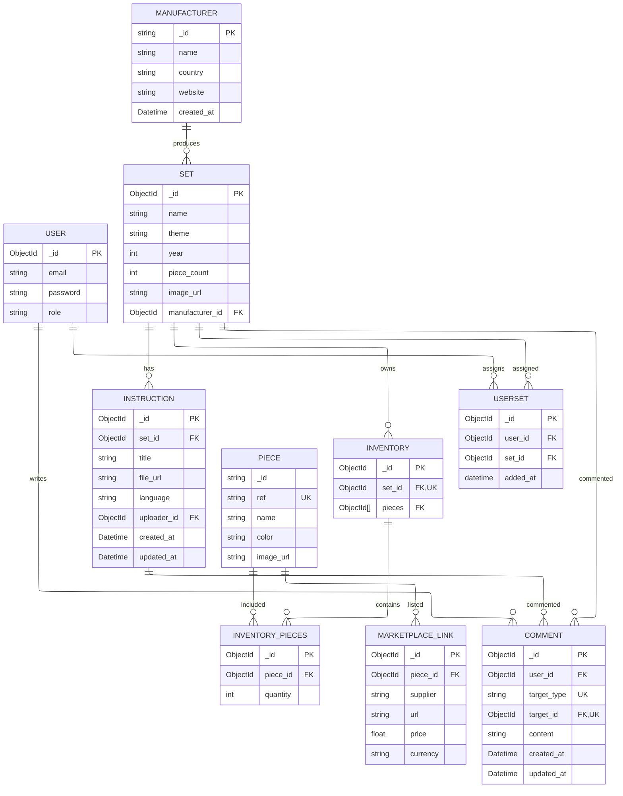

# Diagramme relationnel BrickVault (Mermaid)

```mermaid
---
config:
    layout: elk
---
erDiagram
  direction TB
  USER {
    ObjectId _id PK
    string email
    string password
    string role
  }
  SET {
    ObjectId _id PK
    string name
    string theme
    int year
    int piece_count
    string image_url
    ObjectId manufacturer_id FK
  }
  MANUFACTURER {
    string _id PK
    string name
    string country
    string website
    Datetime created_at
  }
  INSTRUCTION {
    ObjectId _id PK
    ObjectId set_id FK
    string title
    string file_url
    string language
    ObjectId uploader_id FK
    Datetime created_at
    Datetime updated_at
  }
  PIECE {
    string _id
    string ref UK
    string name
    string color
    string image_url
  }
  INVENTORY {
    ObjectId _id PK
    ObjectId set_id FK, UK
    ObjectId[] pieces FK
  }
  INVENTORY_PIECES {
    ObjectId _id PK
    ObjectId piece_id FK
    int quantity
  }
  MARKETPLACE_LINK {
    ObjectId _id PK
    ObjectId piece_id FK
    string supplier
    string url
    float price
    string currency
  }
  COMMENT {
    ObjectId _id PK
    ObjectId user_id FK
    string target_type UK
    ObjectId target_id FK, UK
    string content
    Datetime created_at
    Datetime updated_at
  }
  USERSET {
    ObjectId _id PK
    ObjectId user_id FK
    ObjectId set_id FK
    datetime added_at
  }

  SET ||--o{ INVENTORY : owns
  USER ||--o{ USERSET : assigns
  USER ||--o{ COMMENT : writes
  SET ||--o{ INSTRUCTION : has
  SET ||--o{ USERSET : assigned
  SET ||--o{ COMMENT : commented
  MANUFACTURER ||--o{ SET : produces
  INVENTORY ||--o{ INVENTORY_PIECES : contains
  PIECE ||--o{ INVENTORY_PIECES : included
  PIECE ||--o{ MARKETPLACE_LINK : listed
  INSTRUCTION ||--o{ COMMENT : commented
```
