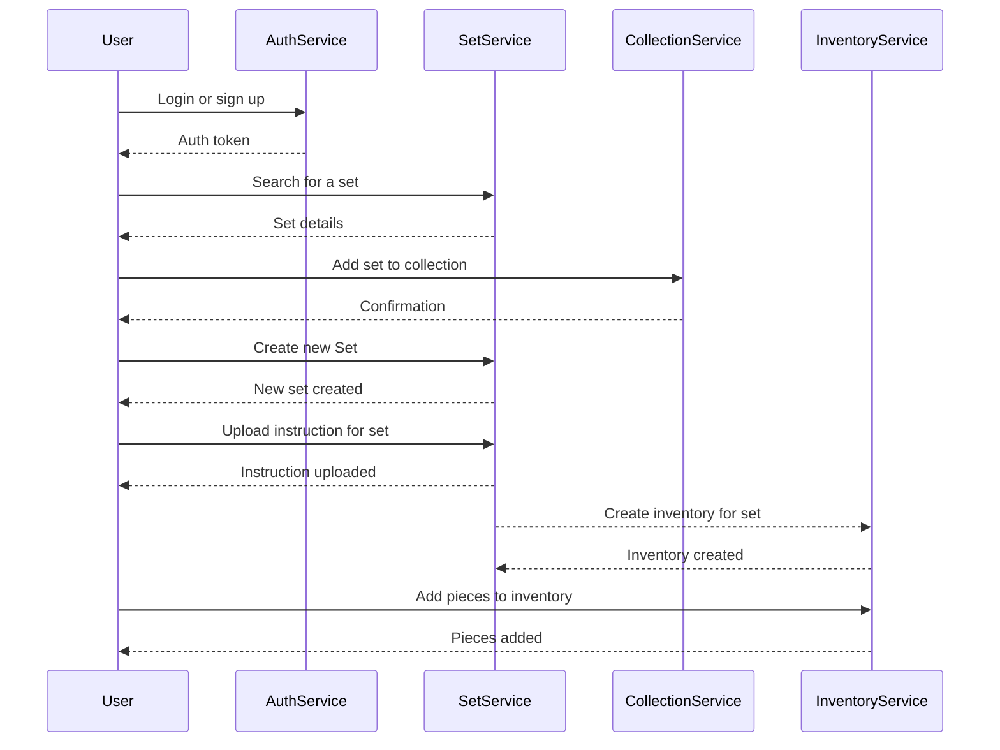

# Schéma relationnel BrickVault (Mermaid)

```mermaid
sequenceDiagram
    participant User
    participant AuthService
    participant SetService
    participant CollectionService

    User->>AuthService: Login or sign up
    AuthService-->>User: Auth token

    User->>SetService: Search for a set
    SetService-->>User: Set details

    User->>CollectionService: Add set to collection
    CollectionService-->>User: Confirmation

    User->>SetService: Create new Set
    SetService-->>User: New set created
    User->>SetService: Upload instruction for set
    SetService-->>User: Instruction uploaded
    SetService-->>InventoryService: Create inventory for set
    InventoryService-->>SetService: Inventory created
    User->>InventoryService: Add pieces to inventory
    InventoryService-->>User: Pieces added
```
